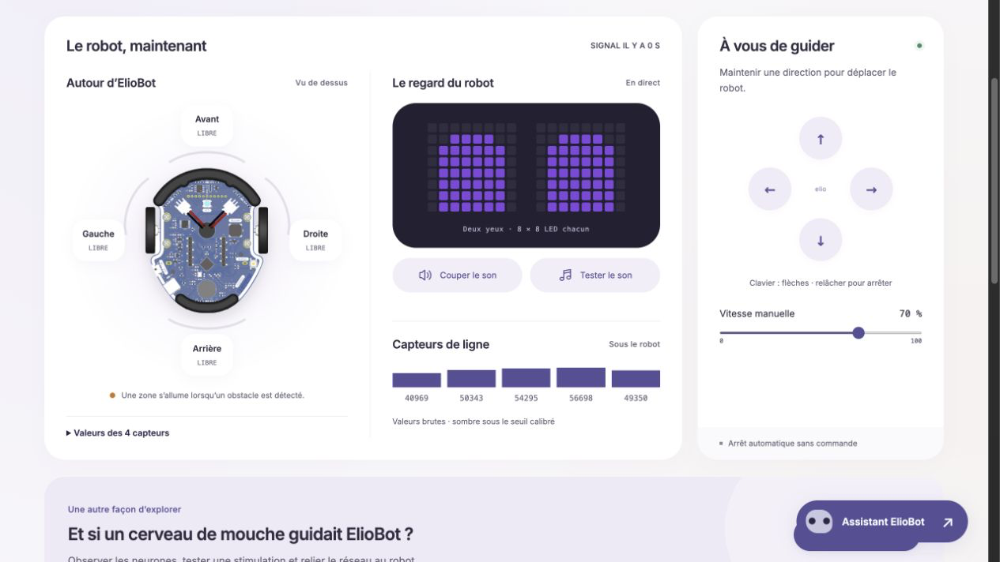

<h1 align="center">
  <br>
  Eliobot Framework
  <br>
</h1>

<h3 align="center">Framework pour programmer un robot <a href="https://eliobot.com">Eliobot</a> (ESP32-S3 + CircuitPython).</h3>

<br>

<p align="center">
  
  
  
  
</p>

<p align="center">
  
</p>

<br>

Il y a deux façons d'utiliser ce framework :

| | On Edge | Serveur |
|---|---|---|
| **Principe** | Un programme tourne directement sur le robot | Le robot est piloté à distance par un serveur |
| **Matériel requis** | Robot seul | Robot + Raspberry Pi (ou tout Linux avec Docker) |
| **Programmes** | `web_server`, `obstacles`, `line_follower`, `ir_control`, `dance`, `animations_fire` | `mqtt_dashboard` |
| **Cas d'usage** | Comportements autonomes embarqués | Dashboard temps réel, exploration cartographique |

---

# Structure du projet

```
Projets-eliobot/
├── deploy.sh                        # Déploiement rsync vers le robot
├── robot/                           # Code embarqué sur le robot
│   ├── main.py                      # Point d'entrée — auto-discovery + safe mode
│   ├── settings.toml                # Config WiFi, programme actif, MQTT  (.gitignore)
│   ├── config.json                  # Calibration capteurs
│   └── programs/
│       ├── hardware.py              # Initialisations hardware
│       ├── registry.py              # Auto-discovery  (ne pas modifier)
│       ├── safe_mode.py             # Mode secours automatique
│       ├── web_server.py            # ─╮
│       ├── obstacles.py             #  │  On Edge
│       ├── line_follower.py         #  │
│       ├── ir_control.py            #  │
│       ├── dance.py                 #  │
│       ├── animations_fire.py       # ─╯
│       └── mqtt_dashboard.py        # ── Serveur (ROS-like)
└── server/
    └── control-dashboard/           # Cerveau — Raspberry Pi / Docker
        ├── docker-compose.yml
        ├── mosquitto/
        └── fastapi-dashboard/
            ├── app.py               # Cerveau exploration + WebSocket + REST
            └── static/
                └── index.html       # Dashboard SPA
```

**Mécanisme auto-discovery :** `main.py` lit `PROGRAM` dans `settings.toml` → `registry.py` charge le module dynamiquement → si crash → `safe_mode.py` prend le relais automatiquement.

---
---

# 1. Utilisation On Edge

> Le programme tourne entièrement sur le robot. Aucun serveur requis.

<br>

## Programmes disponibles

| Programme | Description |
|---|---|
| `web_server` | Serveur HTTP embarqué — contrôle moteurs, buzzer et LEDs depuis un navigateur sur le réseau local |
| `obstacles` | Évitement d'obstacles autonome en boucle |
| `line_follower` | Suivi de ligne avec capteurs IR et retour visuel sur la matrice LED |
| `ir_control` | Contrôle par télécommande infrarouge avec retour émotionnel (yeux + buzzer) |
| `dance` | Chorégraphie synchronisée moteurs + buzzer + matrice LED (~25s) |
| `animations_fire` | Animations matricielles en boucle |
| `safe_mode` | Mode de secours — activé automatiquement si le programme actif crashe |

## Déployer un programme

```toml
# robot/settings.toml
PROGRAM  = "obstacles"
SSID     = "VotreReseau"
PASSWORD = "VotreMotDePasse"
```

```bash
./deploy.sh                    # Déploie le programme défini dans settings.toml
./deploy.sh -p line_follower   # Override du programme au vol
./deploy.sh --dry-run          # Simulation sans copie
```

## Créer un programme

Créer un fichier dans `robot/programs/` avec une fonction `run()`. C'est tout.

```python
# robot/programs/mon_programme.py
from .hardware import setup_motors, setup_buzzer, setup_matrix, sleep_ms, every_ms

PROGRAM_NAME = "mon_programme"

def run():
    motors = setup_motors()
    buzzer = setup_buzzer()
    matrix = setup_matrix()

    buzzer.sound_startup()

    while True:
        if every_ms("check", 200):
            # Ta logique ici
            pass
        sleep_ms(20)
```

```bash
./deploy.sh -p mon_programme
```

> `every_ms("key", period_ms)` retourne `True` toutes les N ms sans jamais bloquer la boucle.
> Aucune modification de `main.py`, `registry.py` ou `__init__.py` requise.

## Calibration (`robot/config.json`)

```json
{
  "line_threshold": 30000,
  "turn_factor": 1.0
}
```

| Clé | Rôle |
|---|---|
| `line_threshold` | Seuil détection ligne noire (`ambient − lit`, max 65535) |
| `turn_factor` | Multiplicateur durée de rotation pour calibrer les 90° |

## Debug REPL USB

```bash
uv run mpremote connect port:/dev/cu.usbmodem* repl   # macOS
uv run mpremote connect port:/dev/ttyACM0 repl         # Linux
```

---

# 2. Utilisation depuis un serveur

> Le robot embarque `mqtt_dashboard` et devient un **exécuteur pur**.
> Le serveur (Raspberry Pi / Docker) est le **cerveau** : il cartographie, décide, commande.

<br>

```
┌──────────────────────────────────┐        ┌──────────────────────────────────┐
│         ROBOT (ESP32-S3)         │        │      SERVEUR (Raspberry Pi)      │
│                                  │  WiFi  │                                  │
│  mqtt_dashboard.py               │ ←────→ │  app.py  (FastAPI + MQTT)        │
│                                  │        │                                  │
│  1. Lit les capteurs             │  MQTT  │  1. Reçoit position + capteurs   │
│  2. Publie l'état                │ ─────→ │  2. Calcule la prochaine action  │
│  3. Attend une commande          │ ←───── │  3. Envoie la commande           │
│  4. Exécute le mouvement         │        │  4. Met à jour la carte          │
└──────────────────────────────────┘        └──────────────────────────────────┘
          Exécuteur pur                         Cerveau — mémoire illimitée,
          RAM limitée (~8MB)                  algorithmes complexes, dashboard
```

<br>

## Installation du serveur

```bash
# 1. Copier sur le Raspberry Pi
rsync -av server/control-dashboard/ root@DietPi:~/eliobot-server/control-dashboard/

# 2. Démarrer les services Docker
cd ~/eliobot-server/control-dashboard
chmod +x setup.sh && ./setup.sh
```

Dashboard accessible sur `http://<IP_DU_PI>:8000`.

**Services Docker :**
- `mosquitto` — broker MQTT Eclipse Mosquitto 2.x (port `1883`)
- `dashboard` — FastAPI + WebSocket (port `8000`)

## Configuration du robot

```toml
# robot/settings.toml
PROGRAM   = "mqtt_dashboard"
BROKER_IP = "<IP_DU_PI>"
PORT      = 1883
SSID      = "VotreReseau"
PASSWORD  = "VotreMotDePasse"
```

```bash
./deploy.sh -p mqtt_dashboard
```

## Fonctionnalités du dashboard

<p align="center">
  
</p>

| Section | Description |
|---|---|
| **Header** | Statut connexion, tension batterie (jaune si branché USB), dernier signal reçu |
| **Sidebar** | D-Pad manuel (dead-man's switch 800ms), slider vitesse, test buzzer, mute son |
| **Tableau de bord** | Capteurs obstacles (SVG), capteurs de ligne (barres + valeurs brutes), yeux LED, état système |
| **Exploration** | Carte Plotly du chemin, bouton Lancer/Arrêter, réinitialisation, journal des étapes |

**Modes :**

| Mode | Description |
|---|---|
| **Manuel** | D-Pad avec dead-man's switch — arrêt si pas de commande dans les 800ms |
| **Exploration** | Navigation autonome ROS-like — le serveur envoie les commandes une par une |
| **Idle** | Robot en veille, moteurs coupés (défaut à la connexion) |

## Topics MQTT

**Robot → Serveur**

| Topic | Payload | Fréquence |
|---|---|---|
| `elio/telemetry/battery` | `float` volts | 5s |
| `elio/telemetry/obstacles` | `{"front", "left", "right", "back"}` | 400ms |
| `elio/telemetry/lines` | `[int × 5]` valeurs brutes `ambient − lit` | 1.5s |
| `elio/telemetry/eyes` | `{"pattern", "color"}` | 500ms |
| `elio/telemetry/mode` | `idle` \| `manual` \| `exploration` | au changement |
| `elio/telemetry/step` | `{x, y, heading, action, front, left, right}` | après chaque action |

**Serveur → Robot**

| Topic | Payload |
|---|---|
| `elio/command/mode` | `idle` \| `manual` \| `exploration` |
| `elio/command/move` | `forward` \| `backward` \| `left` \| `right` \| `stop` |
| `elio/command/speed` | `int` 0–100 |
| `elio/command/explore_step` | `forward` \| `turn_right` \| `turn_left` \| `uturn` |
| `elio/command/buzzer` | `1` |
| `elio/command/mute` | `1` \| `0` |
| `elio/command/reset_map` | `1` |

---

# 3. API Hardware

> Disponible dans tous les programmes via `from .hardware import ...`

<br>

## Motors

```python
motors = setup_motors()

motors.move_forward(speed=70)
motors.move_backward(speed=70)
motors.turn_left(speed=70)
motors.turn_right(speed=70)
motors.turn_in_place(speed=70, direction="left")
motors.motor_stop()
```

## Buzzer

```python
buzzer = setup_buzzer()

buzzer.play_tone(440, 0.2)      # fréquence Hz, durée s
buzzer.sound_startup()
buzzer.sound_bump()
buzzer.sound_blink()
buzzer.sound_happy()
buzzer.sound_laser()
buzzer.emotion_joie()
buzzer.emotion_colere()
buzzer.melody_marseillaise()
```

## EyesMatrix

```python
matrix = setup_matrix()

matrix.set_matrix_logo(matrix.emotionHappy,   (87, 49, 150))   # violet
matrix.set_matrix_logo(matrix.emotionAngry,   (255, 0, 0))
matrix.set_matrix_logo(matrix.arrowUp,        (0, 180, 80))
matrix.set_matrix_logo(matrix.emotionNeutral, (50, 50, 50))
matrix.clear_matrix()
```

## ObstacleSensor

```python
sensors = setup_obstacle_sensors()

sensors.get_obstacle(0)  # Avant gauche
sensors.get_obstacle(1)  # Avant (centre)
sensors.get_obstacle(2)  # Avant droit
sensors.get_obstacle(3)  # Arrière
```

## LineSensor

```python
line_sensor = setup_line_sensor(motors)

# Valeur brute par capteur : ambient - lit  (0 à ~65535)
# Valeur élevée positive = ligne noire détectée
line_sensor.lineCmd.value = True
lit     = [inp.value for inp in line_sensor.lineInput]
line_sensor.lineCmd.value = False
ambient = [inp.value for inp in line_sensor.lineInput]
values  = [ambient[i] - lit[i] for i in range(5)]
```

## Timers non-bloquants

```python
from .hardware import every_ms, now_ms, sleep_ms

while True:
    if every_ms("batt", 5000):
        # Exécuté toutes les 5 secondes
        v = motors.get_battery_voltage()

    if every_ms("display", 500):
        # Exécuté toutes les 500ms
        matrix.set_matrix_logo(matrix.emotionHappy, (87, 49, 150))

    sleep_ms(20)
```

---

# Ressources

- [Eliobot](https://eliobot.com) — site officiel et documentation hardware
- [CircuitPython](https://circuitpython.org) — runtime embarqué
- [FastAPI](https://fastapi.tiangolo.com) — backend dashboard
- [Eclipse Mosquitto](https://mosquitto.org) — broker MQTT
