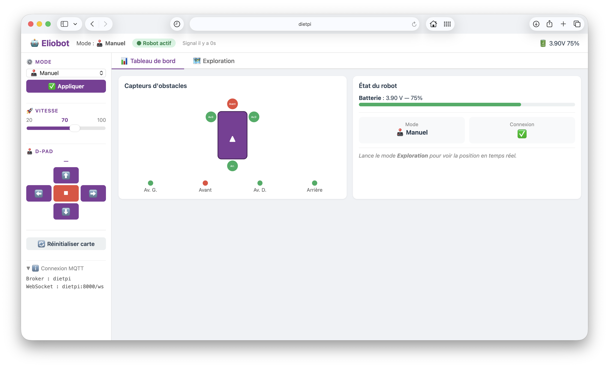

<h1 align="center">
  <br>
  Eliobot Framework v1.3
  <br>
</h1>

<h4 align="center">Framework simple et direct pour programmer <a href="https://eliobot.com">Eliobot</a> (ESP32-S3 + CircuitPython).</h4>

<p align="center">
  
  
  
</p>

<p align="center">
  <a href="#-architecture">Architecture</a> •
  <a href="#-utilisation-rapide">Utilisation</a> •
  <a href="#%EF%B8%8F-configuration">Configuration</a> •
  <a href="#-programmes-disponibles">Programmes</a> •
  <a href="#-dashboard-mqtt--fastapi">Dashboard</a> •
  <a href="#-créer-un-programme">Créer un programme</a> •
  <a href="#-api">API</a>
</p>

<p align="center">

</p>

---

# Objectifs

- Un **seul point d'entree** (`main.py`)
- Ajout de programmes **sans modifier le framework**
- Deploiement rapide et sûr via `rsync`
- Comportement stable meme en cas d'erreur (safe mode)

<br>

# Architecture

```
Projets-eliobot/
├── deploy.sh              # Script de deploiement (override programme, dry-run...)
├── robot/                 # Tout ce qui est copie sur le robot
│   ├── main.py            # Point d'entree (auto-discovery + safe mode)
│   ├── settings.toml      # Configuration (WiFi, programme actif, MQTT...)
│   ├── config.json        # Calibration capteurs
│   ├── programs/          # Programmes applicatifs
│   │   ├── hardware.py    # Fonctions setup (motors, buzzer, matrix...)
│   │   ├── registry.py    # Auto-discovery des programmes
│   │   ├── safe_mode.py   # Programme de secours
│   │   ├── web_server.py  # Serveur web HTTP
│   │   ├── mqtt_client.py # Client MQTT
│   │   ├── mqtt_dashboard.py # Client MQTT avancé (dashboard)
│   │   ├── obstacles.py   # Evitement d'obstacles
│   │   ├── animations_fire.py # Animations LED
│   │   ├── dance.py       # Chorégraphie moteurs + LEDs + buzzer
│   │   ├── ir_control.py  # Contrôle télécommande infrarouge
│   │   └── line_follower.py   # Suivi de ligne
│   ├── lib/               # Bibliotheques (elio.py + Adafruit)
│   ├── www/               # Interface web
│   └── sd/                # Fichiers SD
└── server/
    └── control-dashboard/ # Dashboard FastAPI + broker MQTT (Raspberry Pi)
```

<br>

# Quick Start

## 1. Choisir un programme

Dans `robot/settings.toml` :

```toml
PROGRAM = "web_server"
```

Les programmes disponibles sont **auto-detectes** dans `robot/programs/`.

## 2. Deployer sur le robot

```bash
./deploy.sh
```

Synchronisation automatique via `rsync`.

## 3. Changer de programme (sans editer de fichier)

```bash
./deploy.sh --program obstacles
./deploy.sh -p animations_fire
```

Afficher ce qui serait copié sans faire de modifications :

```bash
./deploy.sh --dry-run
```

<br>

# Configuration

### `robot/settings.toml`

```toml
PROGRAM = "web_server"

SSID = "VotreReseau"
PASSWORD = "VotreMotDePasse"

BROKER_IP = "raspberrypi.local"
PORT = 1883
```

### `robot/config.json`

```json
{
    "line_threshold": 75000
}
```

Utilise pour la calibration du capteur de ligne.

<br>

# Programmes disponibles

| Programme | Description |
|---|---|
| `web_server` | Serveur HTTP embarqué — contrôle moteurs, buzzer et LEDs depuis un navigateur |
| `mqtt_client` | Client MQTT simple — publie la télémétrie (obstacles, batterie) et reçoit des commandes |
| `mqtt_dashboard` | Client MQTT avancé — télémétrie complète + contrôle manuel + mode exploration autonome (compatible dashboard) |
| `obstacles` | Évitement d'obstacles autonome (règle de la main droite) |
| `line_follower` | Suivi de ligne avec capteur IR et retour visuel sur la matrice LED |
| `ir_control` | Contrôle par télécommande infrarouge avec émotions visuelles et sonores |
| `dance` | Chorégraphie synchronisée moteurs + buzzer + matrice LED (~25 secondes) |
| `animations_fire` | Animations matricielles en boucle (feu, patterns...) |
| `safe_mode` | Mode de secours automatique — activé si le programme sélectionné crashe |

<br>

# Dashboard MQTT + FastAPI

<p align="center">
  
</p>

Dashboard temps réel pour monitorer et contrôler le robot depuis un Raspberry Pi (ou tout Linux avec Docker). Il combine un broker MQTT Eclipse Mosquitto et un backend FastAPI exposant une interface web via WebSocket.

> Voir [server/control-dashboard/README.md](server/control-dashboard/README.md) pour l'installation complète.

## Architecture du dashboard

```
control-dashboard/
├── docker-compose.yml          # Orchestration des services
├── setup.sh                    # Script d'installation (Raspberry Pi)
├── mosquitto/
│   └── mosquitto.conf          # Configuration du broker MQTT
└── fastapi-dashboard/          # Dashboard FastAPI + WebSocket
    ├── app.py                  # Backend FastAPI (MQTT + WebSocket + REST)
    ├── static/
    │   └── index.html          # Frontend SPA (HTML + JS + Plotly CDN)
    ├── pyproject.toml
    └── Dockerfile
```

**Services Docker :**
- `mosquitto` — Broker MQTT Eclipse Mosquitto 2.x (port `1883`)
- `dashboard` — Dashboard FastAPI (port `8000`)

## Mise en route rapide

**1. Déployer sur le Raspberry Pi :**

```bash
rsync -av server/control-dashboard/ root@DietPi:~/eliobot-server/control-dashboard/
```

**2. Démarrer les services :**

```bash
cd ~/eliobot-server/control-dashboard
chmod +x setup.sh && ./setup.sh
```

**3. Configurer le robot (`robot/settings.toml`) :**

```toml
PROGRAM   = "mqtt_dashboard"
BROKER_IP = "<IP_DU_PI>"
PORT      = 1883
```

**4. Déployer le programme MQTT sur le robot :**

```bash
./deploy.sh -p mqtt_dashboard
```

Le dashboard est accessible sur `http://<IP_DU_PI>:8000`.

## Fonctionnalités

| Section | Description |
|---|---|
| **Header** | Statut connexion (🟢/🟡/🔴), dernier signal reçu, niveau batterie |
| **Sidebar** | Sélecteur de mode, slider vitesse, D-Pad de contrôle |
| **Capteurs** | Vue SVG des obstacles (avant gauche/droit, arrière), état du robot |
| **Exploration** | Carte Plotly du chemin parcouru, obstacles détectés, journal des déplacements |

**Modes de fonctionnement :**

- **Idle** — robot en veille, moteurs coupés
- **Manuel** — D-Pad maintenu avec dead-man's switch (arrêt automatique si pas de commande reçue dans les 800ms)
- **Exploration** — navigation autonome par la règle de la main droite, carte affichée en temps réel

## Topics MQTT

| Topic | Direction | Payload |
|---|---|---|
| `elio/telemetry/battery` | Robot → Serveur | `float` — tension en volts |
| `elio/telemetry/obstacles` | Robot → Serveur | JSON `{front, left, right, back}` |
| `elio/telemetry/mode` | Robot → Serveur | `idle` \| `manual` \| `exploration` |
| `elio/telemetry/step` | Robot → Serveur | JSON — étape d'exploration (x, y, heading, action) |
| `elio/command/mode` | Serveur → Robot | `idle` \| `manual` \| `exploration` |
| `elio/command/move` | Serveur → Robot | `forward` \| `backward` \| `left` \| `right` \| `stop` |
| `elio/command/speed` | Serveur → Robot | `int` 0–100 |
| `elio/command/reset_map` | Serveur → Robot | `1` |

<br>

# Creer un programme

## Exemple minimal

Creer un fichier dans `robot/programs/` :

```python
# programs/mon_programme.py
from .hardware import setup_buzzer, setup_matrix, sleep_ms

PROGRAM_NAME = "mon_programme"  # Optionnel, sinon = nom du fichier

def run():
    # Setup
    buzzer = setup_buzzer()
    matrix = setup_matrix()

    buzzer.sound_startup()

    # Boucle principale
    while True:
        # Ta logique ici
        sleep_ms(100)
```

> Aucune modification de `main.py` ni de `__init__.py` requise.

## Deploiement sur le robot

```bash
./deploy.sh --program mon_programme
```

<br>

# API

## Fonctions hardware (`programs/hardware.py`)

```python
from .hardware import (
    setup_motors,           # Retourne l'objet Motors
    setup_buzzer,           # Retourne l'objet Buzzer
    setup_matrix,           # Retourne l'objet EyesMatrix
    setup_obstacle_sensors, # Retourne l'objet ObstacleSensor
    sleep_ms,               # Pause en millisecondes
    now_ms,                 # Temps actuel en millisecondes
    every_ms,               # Timer periodique non-bloquant
)
```

### Exemple avec timer periodique

```python
from .hardware import setup_matrix, sleep_ms, every_ms

def run():
    matrix = setup_matrix()
    toggle = False

    while True:
        # Execute toutes les 500ms
        if every_ms("blink", 500):
            if toggle:
                matrix.clear_matrix()
            else:
                matrix.set_matrix_logo(matrix.emotionHappy, (87, 49, 150))
            toggle = not toggle

        sleep_ms(10)
```

Ici, l'affichage de la matrice clignote toutes les 500ms sans bloquer la boucle principale.

## Buzzer

```python
buzzer = setup_buzzer()

# Sons basiques
buzzer.play_tone(440, 0.2)        # Frequence, duree
buzzer.play_tone(440, 0.2, 80)    # Frequence, duree, volume

# Effets sonores
buzzer.sound_startup()
buzzer.sound_bump()
buzzer.sound_happy()
buzzer.sound_laser()
buzzer.sound_alert()

# Melodies
buzzer.melody_hmm()
buzzer.melody_alert()
buzzer.melody_marseillaise()

# Emotions
buzzer.emotion_joie()
buzzer.emotion_colere()
buzzer.emotion_surprise()
```

## Motors

```python
motors = setup_motors()

# Deplacement
motors.move_forward(speed=100)
motors.move_backward(speed=100)
motors.turn_left(speed=100)
motors.turn_right(speed=100)
motors.motor_stop()

# Deplacement precis
motors.move_one_step("forward", distance=20)  # en cm
motors.turn_one_step("left", angle=90)        # en degres
```

## EyesMatrix

```python
matrix = setup_matrix()

# Affichage
matrix.clear_matrix()
matrix.set_matrix_logo(matrix.emotionHappy, (87, 49, 150))

# Emotions disponibles
matrix.emotionHappy
matrix.emotionSad
matrix.emotionAngry
matrix.emotionLove
matrix.emotionAmazed
matrix.emotionConfused
# ... et plus
```

## ObstacleSensor

```python
sensors = setup_obstacle_sensors()

# Detection (True si obstacle)
sensors.get_obstacle(0)  # Avant gauche
sensors.get_obstacle(1)  # Avant
sensors.get_obstacle(2)  # Avant droit
sensors.get_obstacle(3)  # Arriere
```

<br>

# Debug

Acces REPL USB :

```bash
uv run mpremote connect port:/dev/cu.usbmodem0115BDE5B8841 repl
```

Pour trouver le nom du port sous macOS :

```bash
ls /dev/cu.usbmodem*
```

et sous linux :

```bash
ls /dev/ttyACM*
```

<br>

# Ressources

- [Eliobot](https://eliobot.com)
- [CircuitPython](https://circuitpython.org)
- [Adafruit CircuitPython Bundle](https://github.com/adafruit/Adafruit_CircuitPython_Bundle)
