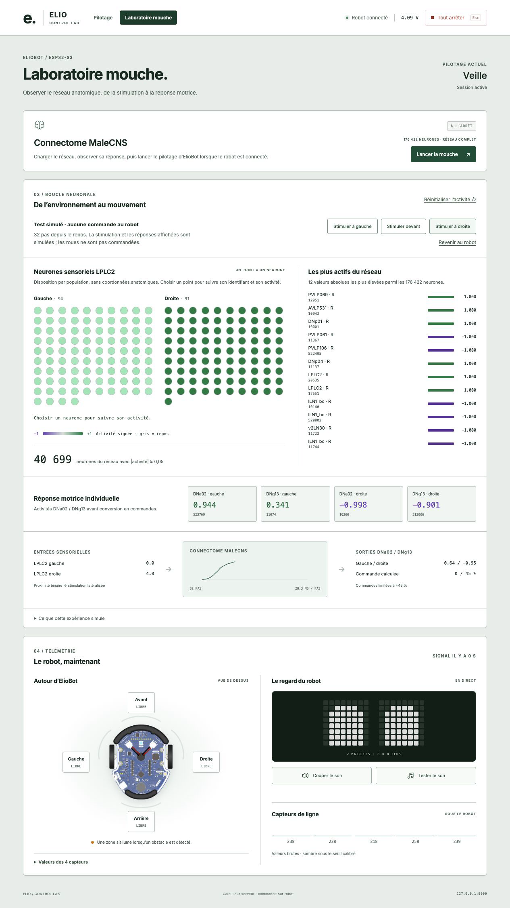
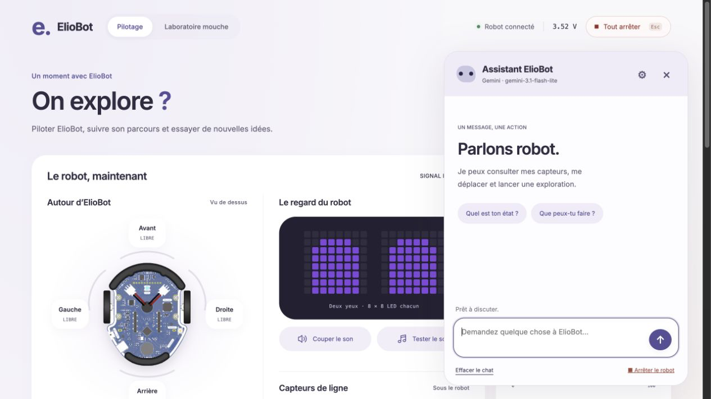

# ElioBot — Dashboard de contrôle

Pilotage manuel, **agent IA avec MCP**, exploration cartographique et **expérience connectomique de mouche** depuis un navigateur. Le serveur FastAPI calcule les décisions ; ElioBot reçoit les commandes et renvoie ses capteurs par MQTT. Le serveur fonctionne sur un ordinateur avec Docker ou sur un Raspberry Pi.

[Retour au README principal](../../README.md) · [Installation](#installation) · [Agent IA et MCP](#agent-ia-et-outils-mcp) · [Mouche connectomique](#mouche-connectomique) · [Dépannage](#dépannage) · [Modèle neuronal détaillé](FLY.md)

## Aperçu

### Console de contrôle — `/`


*La télémétrie et les commandes manuelles ont la même hauteur sur ordinateur. Le parcours d’exploration occupe toute la largeur plus bas ; son bouton de lancement reste directement sur la carte. Les cartes s’empilent sur mobile.*

L’interface utilise le violet ElioBot **#574F96**, des fonds lavande discrets et des formes arrondies.

### Laboratoire mouche — `/fly`



*Capture d’un test simulé de 32 pas sur le connectome complet. Les activités sont calculées par le modèle ; aucune commande moteur n’est envoyée au robot pendant ce test.*

## Ce que permet le dashboard

| Fonction | Utilisation |
|---|---|
| **Pilotage manuel** | Maintenir une direction sur le D-pad ou au clavier ; régler la vitesse de 0 à 100 % |
| **Exploration** | Lancer, mettre en pause ou reprendre directement depuis le bouton sur la carte ; consulter la trajectoire estimée et le journal |
| **Laboratoire mouche** | Charger le connectome, visualiser son activité, tester une stimulation ou le relier au robot |
| **Télémétrie** | Vue du robot avec quatre zones de détection, valeurs brutes et seuils, capteurs de ligne et reproduction des deux matrices LED 8 × 8 |
| **Son** | Boutons avec icônes pour couper/réactiver le son et lancer un son de test |
| **Arrêt général** | Bouton **Tout arrêter** ou touche Échap |
| **Assistant ElioBot** | Chat textuel avec Gemini ou Ollama, actions via MCP, configuration et gestion des modèles |

### Agent IA et outils MCP

Pour comprendre le code pas à pas : **[Cours — chatbot, LLM, MCP et interface ElioBot](COURS_CHATBOT_MCP.md)**, avec extraits du projet, schémas, exercices et questions corrigées.

Le bouton **Assistant ElioBot**, en bas à droite sur les deux pages, ouvre un agent conversationnel avec **Gemini ou Ollama**. Il interprète la demande, appelle des outils et utilise leurs résultats pour répondre. Exemples : « Quel est ton état ? », « Tourne de 70 degrés à droite », « Mets l’exploration en pause ».

**MCP (Model Context Protocol)** relie l’agent aux capacités du robot : le client intégré initialise une session, découvre les outils et appelle le serveur MCP local. Ces outils passent par le contrôle FastAPI existant, puis MQTT transmet les commandes à ElioBot.

| Outil MCP | Action |
|---|---|
| `get_robot_state` | Lire l’état, les capteurs et le pilotage actuel |
| `move_robot` | Déplacer le robot pendant une durée bornée |
| `turn_robot` | Demander une rotation approximative en degrés |
| `set_robot_speed` | Régler la vitesse manuelle |
| `set_autonomy` | Lancer ou mettre en pause l’exploration ou la mouche |
| `stop_robot` | Arrêter le robot |

Le chat affiche les actions et leurs résultats. Les déplacements sont limités à **0,1–3 secondes** et **70 % de vitesse maximum**. Une reprise manuelle ou un arrêt invalide les actions en attente ; l’agent respecte la confirmation de reprise depuis une autonomie. Une commande envoyée ne prouve pas que le déplacement physique a été réalisé.



L’accès MCP depuis un client externe est désactivé par défaut. Le guide détaille son activation avec un jeton, l’URL `/mcp/` et le transport Streamable HTTP. Le chat intégré fonctionne sans cette activation externe.

Les réglages permettent de passer de Gemini à Ollama, de télécharger un modèle et de gérer le conteneur Ollama créé par ElioBot, jusqu’à sa désinstallation avec conservation ou suppression explicite des modèles.

La clé Gemini peut être lue dans le `.env` du serveur ou enregistrée depuis les réglages. Le lanceur multiplateforme détecte le système hôte ; sur Mac et Windows, l’interface guide aussi la connexion à l’application native Ollama. **[Installation, configuration, limites et désinstallation →](ASSISTANT.md)**

### Passer d’un pilotage à l’autre

Il n’y a pas de sélecteur de mode : les actions choisissent le pilotage.

- Lancer l’exploration ou la mouche interrompt le pilotage manuel.
- Demander une direction manuelle pendant une autonomie ouvre une confirmation. La confirmer met l’autonomie en pause et donne la main au pilotage manuel ; elle ne déclenche pas de mouvement à elle seule.
- **Reprendre** relance l’autonomie en pause. L’historique reste disponible.
- **Tout arrêter** revient en veille. Une reconnexion du robot ne relance jamais automatiquement les moteurs.
- Ouvrir une autre page ou un autre navigateur ne change pas le pilotage.

Le D-pad renouvelle sa commande toutes les 250 ms. Le robot arrête le mouvement manuel si aucune commande ne lui parvient pendant 800 ms. Le navigateur relâche aussi la commande en cas de perte de focus ou de connexion. Les échéances sont vérifiées dans la boucle embarquée ; les appels réseau synchrones peuvent ajouter du délai.

La carte d’exploration repose sur des mouvements temporisés, sans mesure de distance réelle. Les facteurs `move_factor` et `turn_factor` servent à la calibration. Un mouvement manuel, neuronal ou interrompu peut rendre la position incertaine. **Réinitialiser** arrête le robot et crée un nouveau repère : replacer ElioBot au point et à l’orientation de départ avant de l’utiliser.

## Installation

### Prérequis

- ElioBot avec CircuitPython et le programme `mqtt_dashboard` à jour.
- Un ordinateur avec Docker, ou un Raspberry Pi/Linux avec Docker Engine et Compose v2.
- Python 3.11+ pour le lanceur multiplateforme (le démarrage direct avec Compose reste possible).
- Le robot et le serveur doivent pouvoir communiquer sur le réseau local.
- Pour la mouche : les caches du projet **Pytorch_fly**, un système 64 bits et assez de mémoire pour le réseau complet. La matrice seule occupe environ **198 Mio en RAM** ; Python, les annotations et le chargement demandent de la mémoire supplémentaire.

### Démarrer sur son ordinateur

Depuis la racine du framework :

```bash
cd server/control-dashboard
./setup.sh
# Windows PowerShell : .\setup.ps1
# Ou directement, tous systèmes : python setup.py
```

Ouvrir [la console locale](http://localhost:8000/) ou [le laboratoire mouche](http://localhost:8000/fly). Depuis une autre machine, remplacer `localhost` par l’adresse IP du serveur.

| Service | Rôle | Port sur l’hôte |
|---|---|---|
| `mosquitto` | Broker MQTT Eclipse Mosquitto 2.x | `1883` — TCP ; `9001` — WebSocket |
| `dashboard` | FastAPI, interface web et calcul neuronal | `8000` |
| `ollama-manager` | Gestion privée du conteneur Ollama appartenant à ElioBot | Aucun |
| Ollama géré (optionnel) | Modèle local ; créé depuis les réglages du chat | Aucun |

Les conteneurs communiquent sur le réseau Docker `elio-net`. Le serveur contacte le broker avec le nom `mosquitto` ; le robot utilise **l’adresse IP de l’ordinateur ou du Raspberry Pi**. `localhost` dans les réglages du robot désignerait le robot lui-même.

### Configurer ElioBot

Dans `robot/settings.toml`, depuis le dossier principal du framework :

```toml
PROGRAM   = "mqtt_dashboard"
SSID      = "VotreReseau"
PASSWORD  = "VotreMotDePasse"
BROKER_IP = "<IP_DU_SERVEUR>"
PORT      = 1883
```

Brancher ElioBot en USB, puis déployer :

```bash
./deploy.sh -p mqtt_dashboard
```

Ce script sélectionne le programme dans le fichier local `settings.toml`, puis copie le dossier `robot/` sur le volume du robot. Les réglages WiFi sont exclus de Git.

### Variante Raspberry Pi / DietPi

Installer Docker Engine et le plugin Compose v2. Sur DietPi :

```bash
dietpi-software install 162
dietpi-software install 134
apt-get install -y docker-buildx-plugin
```

Depuis la racine du framework sur l’ordinateur :

```bash
rsync -av server/control-dashboard/ root@DietPi:~/eliobot-server/control-dashboard/
```

Puis, sur le Raspberry Pi :

```bash
cd ~/eliobot-server/control-dashboard
chmod +x setup.sh
./setup.sh
```

La barre oblique finale de la source `rsync` copie le contenu du dossier. Si la mouche est utilisée, préparer ses caches avant le transfert, ou copier ensuite `fly-data/` au même emplacement sur le Pi.

## Mouche connectomique

Le laboratoire utilise le connectome anatomique **MaleCNS v1.0** fourni par Pytorch_fly : **176 422 neurones et 25 862 574 connexions dirigées pondérées**. Le serveur calcule la dynamique du réseau complet avec NumPy/SciPy ; le robot ne charge pas ce réseau en mémoire.

### Préparer et lancer l’expérience

1. Depuis la racine du framework, sur la machine contenant Pytorch_fly :

   ```bash
   python3 server/control-dashboard/prepare_fly.py /chemin/vers/Pytorch_fly
   ```

   Le script copie les caches nécessaires dans `server/control-dashboard/fly-data/` et écrit leurs empreintes SHA-256. Il ne modifie pas Pytorch_fly. Les données occupent environ **85 Mio sur disque**, restent exclues de Git et sont montées en lecture seule dans le conteneur.

2. Démarrer ou mettre à jour le serveur, puis déployer `mqtt_dashboard` sur le robot :

   ```bash
   # Depuis la racine du framework
   docker compose -f server/control-dashboard/docker-compose.yml up -d --build
   ./deploy.sh -p mqtt_dashboard
   ```

3. Ouvrir `/fly`, cliquer sur **Charger le cerveau**, puis attendre la fin du chargement.
4. Pour observer le modèle sans mouvement, utiliser **Stimuler à gauche / devant / à droite**.
5. Pour utiliser les vrais capteurs, cliquer sur **Lancer la mouche** avec le robot connecté. **Mettre en pause** interrompt le pilotage ; **Réinitialiser l’activité**, disponible à l’arrêt, remet le réseau au repos.

L’absence ou l’invalidité des caches produit une erreur explicite : aucun réseau synthétique ne les remplace. Le robot doit annoncer `protocol: 2` ou supérieur pour que le serveur accepte ce pilotage.

### Des capteurs aux roues

| Capteur physique | Entrée du modèle |
|---|---|
| Avant gauche — index 0 | Stimule les 94 neurones LPLC2 gauches |
| Avant central — index 1 | Stimule les deux populations et supprime l’avance en présence d’un obstacle |
| Avant droit — index 2 | Stimule les 91 neurones LPLC2 droits |
| Arrière — index 3 | Affiché dans la télémétrie, sans population neuronale supplémentaire |

La détection est binaire, sans mesure de distance : une détection apporte une intensité de 4 à la population correspondante. Les quatre neurones de sortie **DNa02 / DNg13** donnent une réponse traduite en commandes des roues, limitées à **±45 %** et expirant après **500 ms**. La protection frontale est revérifiée sur le robot ; elle conserve la rotation calculée en supprimant l’avance.

**Un obstacle à droite ne garantit pas un virage à gauche, ni l’inverse.** La réponse dépend des connexions et de l’activité antérieure du réseau. Le câblage est anatomique, mais la dynamique et la correspondance avec les roues sont des modèles simplifiés : ce n’est pas une reconstitution physiologique validée ni un système d’évitement garanti. Sans stimulation initiale, le réseau reste au repos ; une activité peut persister après le retrait d’un obstacle.

### Observer les neurones

Le laboratoire affiche :

- les **185 neurones sensoriels LPLC2**, avec identifiant et activité signée ; leur disposition représente des populations, pas des positions anatomiques ;
- les **12 neurones les plus actifs** du réseau en valeur absolue et le nombre de neurones dont `|activité| ≥ 0,05` ;
- les **quatre sorties motrices individuelles**, la courbe d’activité moyenne et les commandes de roues calculées.

Les boutons de stimulation exécutent **32 pas depuis le repos dans un état séparé**. Le bandeau **Test simulé · aucune commande au robot** distingue ce test du pilotage réel. Il ne modifie pas l’activité utilisée pour conduire ElioBot. **Revenir au robot** rétablit l’affichage du réseau de pilotage.

Les valeurs de roues affichées sont les **consignes calculées**, pas une mesure de leur vitesse réelle. Les détails de l’intégration, des gains, du protocole et des vérifications sont dans [FLY.md](FLY.md).

## Télémétrie et calibration

La carte **Le robot, maintenant** superpose quatre zones de détection à une vue d’ElioBot. Les matrices affichent les motifs envoyés par le robot, y compris les flèches du pilotage manuel. Les mises à jour des yeux passent en priorité lorsqu’un motif change ; les autres groupes de télémétrie sont envoyés à tour de rôle.

Ouvrir **Valeurs des 4 capteurs** pour comparer leurs valeurs brutes et leurs seuils. Les seuils se règlent dans `robot/config.json`, dans l’ordre **gauche, avant, droite, arrière** :

```json
"obstacle_thresholds": [10000, 10000, 10000, 10000]
```

Il s’agit d’un champ à modifier dans le fichier existant, en conservant les autres réglages. Une détection correspond à `valeur brute < seuil`. Ces seuils logiciels ne représentent pas des distances et sont distincts du seuil des capteurs de ligne. Redéployer puis redémarrer le robot après modification. Voir la [calibration du framework](../../README.md#calibration-robotconfigjson).

| Statut affiché | Signification |
|---|---|
| **Robot connecté** | Signal MQTT reçu dans les 3 dernières secondes, connexion navigateur disponible |
| **Robot absent** | Broker connecté, mais aucun signal récent du robot |
| **Hors connexion** | Liaison MQTT ou WebSocket perdue |

## Architecture et protocoles

```text
control-dashboard/
├── README.md
├── FLY.md                     # Modèle, limites et protocole neuronal
├── prepare_fly.py             # Préparation des caches locaux
├── fly-data/                  # Données ignorées par Git, montées en lecture seule
├── docker-compose.yml
├── setup.sh
├── mosquitto/mosquitto.conf
└── fastapi-dashboard/
    ├── app.py                 # Arbitrage, exploration, MQTT, REST et WebSocket
    ├── fly_brain.py           # Calcul du réseau neuronal complet
    ├── Dockerfile
    ├── pyproject.toml
    └── static/
        ├── index.html         # Pages / et /fly
        ├── dashboard.css
        ├── dashboard.js
        ├── eye-patterns.json  # Motifs des matrices LED
        └── eliobot.png
```

FastAPI pousse les changements par WebSocket toutes les 300 ms, sans recharger la page. Les cartes et courbes sont dessinées localement en SVG, sans CDN.

### Robot → serveur

| Topic MQTT | Contenu | Cadence cible |
|---|---|---|
| `elio/telemetry/battery` | Tension en volts | 5 s |
| `elio/telemetry/obstacles` | `{front, left, right, back, raw, thresholds}` ; `raw` et `thresholds` sont des dictionnaires par direction | 400 ms |
| `elio/telemetry/eyes` | `{pattern, color}` | Au changement, sinon 500 ms |
| `elio/telemetry/lines` | Cinq valeurs brutes `ambient − lit` | 1,5 s |
| `elio/telemetry/mode` | `idle`, `manual`, `exploration` ou `fly` | Au changement et environ 1 s |
| `elio/telemetry/status` | `{protocol, line_threshold, position_valid, last_error}` | Environ 1 s |
| `elio/telemetry/step` | Étape d’exploration identifiée | Après une action, réémise après 1 s sans réponse |
| `elio/telemetry/fly_sensors` | `{session, frame, left, front, right, back}` | Jusqu’à 5 Hz en mode mouche ; remplacement après 600 ms sans réponse |

Ces cadences ne sont pas des garanties temps réel ; elles dépendent de la boucle embarquée et du réseau.

### Serveur → robot

| Topic MQTT | Contenu | Rôle |
|---|---|---|
| `elio/command/mode` | `idle`, `manual`, `exploration` ou `fly` | Choisir le pilotage |
| `elio/command/move` | `forward`, `backward`, `left`, `right` ou `stop` | Commande manuelle |
| `elio/command/speed` | Entier 0–100 | Vitesse manuelle |
| `elio/command/explore_step` | `{session, step_id, action}` | `forward`, `turn_right`, `turn_left` ou `uturn` |
| `elio/command/fly_drive` | `{session, frame, left, right}` | Consignes de roues entières entre −45 et 45 % |
| `elio/command/reset_map` | `1` | Arrêter et réinitialiser la carte |
| `elio/command/buzzer` | `1` | Son de test |
| `elio/command/mute` | `1` ou `0` | Couper ou réactiver le son |

Une étape d’exploration contient notamment :

```json
{
  "session": "a52fc328f604bc10", "step_id": 12, "completed_id": 11,
  "position_valid": true, "x": 3, "y": 2, "heading": 1,
  "action": "moved_forward", "front": false, "left": true, "right": false
}
```

`heading` vaut `0` pour le nord, `1` pour l’est, `2` pour le sud et `3` pour l’ouest. Le couple `(session, step_id)` permet de réémettre une décision sans rejouer un mouvement ni dupliquer le journal. `completed_id` confirme la commande terminée. La mouche utilise de même un couple `(session, frame)` ; une réponse ancienne ou en double ne prolonge pas le mouvement.

### WebSocket et compatibilité

`/ws` envoie d’abord `{type: "snapshot", state: {...}}`, puis des messages `{type: "delta", state: {...}, steps_append: [...]}`. `steps_append` est facultatif ; une réinitialisation remplace `state.steps`. Le navigateur conserve au maximum 1 000 étapes.

Le **protocole dashboard 3** est distinct du **protocole robot 2**. La page vérifie sa compatibilité avec le serveur. Les anciennes commandes d’exploration en texte brut ne sont plus exécutées : mettre à jour le robot et le serveur ensemble.

## Développement et mise à jour

Le code Python et l’interface sont **copiés dans la même image Docker**. Les données `fly-data/`, `assistant-data/` et `assistant-runtime/` sont montées depuis le disque : un simple `restart` ne prend pas en compte une modification des sources.

Depuis `server/control-dashboard/` :

```bash
# Reconstruire et remplacer le dashboard après une modification
docker compose up -d --build --no-deps dashboard

# Consulter les journaux
docker compose logs -f dashboard
docker compose logs -f mosquitto

# Arrêter les services en conservant leurs volumes
docker compose down
```

Recharger le navigateur après mise à jour. Un redémarrage du serveur remet le modèle neuronal à l’état non chargé ; cliquer de nouveau sur **Charger le cerveau**.

Pour les tests sans déplacement physique, depuis la racine du framework :

```bash
uv run --project server/control-dashboard/fastapi-dashboard --group dev pytest tests -q
node --test tests/*.test.cjs
```

La comparaison avec le moteur de référence et les données réelles de Pytorch_fly est décrite dans [FLY.md](FLY.md).

## Dépannage

### `undefined is not an object` ou `Not Found`

Vérifier que le navigateur utilise le bon serveur, reconstruire l’image avec la commande ci-dessus puis recharger la page. Une interface récente servie par un ancien backend peut produire ces erreurs. `/health` doit annoncer `protocol: 3`.

### La mouche se met en pause

Le serveur distingue une absence totale d’observations d’un flux interrompu, en indiquant la dernière trame reçue. Après les 2 secondes de démarrage, une interruption supérieure à 1,5 seconde met le pilotage en pause. Une observation de plus de 600 ms n’est pas utilisée, et une réponse calculée après 550 ms est écartée. Le robot conserve aussi son expiration locale des roues à 500 ms.

Consulter `docker compose logs -f dashboard` :

- **`[Mouche] Pause`** indique le nombre d’observations, de réponses transmises, de calculs périmés et l’âge de la dernière trame.
- **`[Robot] Erreur embarquée`** remonte les erreurs de réception MQTT, de télémétrie et d’envoi des observations. `last_error` conserve l’étape, le message, la session et le temps depuis le démarrage, même après reconnexion ; un redémarrage complet l’efface.
- Une reconnexion du robot le remet en veille : relancer explicitement le pilotage une fois la liaison rétablie.

Si le phénomène apparaît sur batterie mais pas en USB, comparer les essais à charge complète et au même endroit. C’est un indice à examiner, pas une preuve suffisante pour attribuer la panne à la batterie.

### Les neurones restent au repos

Le chargement ne stimule pas le réseau. Utiliser les boutons de test, ou présenter un obstacle à un capteur gauche/droit/avant pendant le pilotage mouche. Le capteur arrière seul ne crée pas de stimulation. Vérifier également les valeurs brutes et les seuils dans la télémétrie.

### Le robot est absent

Vérifier le programme sélectionné, les réglages WiFi, l’adresse `BROKER_IP` et l’accès au port `1883`. Le navigateur peut être connecté au dashboard alors que le robot ne l’est pas. Éviter les clés dupliquées dans `settings.toml`.

### Docker ou dashboard inaccessible

- Si Compose réclame Buildx sur DietPi : `apt-get install -y docker-buildx-plugin`.
- Si le dashboard n’est pas accessible depuis une autre machine : vérifier l’adresse du serveur et le pare-feu sur le port `8000`.
- Si `rsync` a créé un dossier `control-dashboard/control-dashboard`, reprendre le transfert avec la barre oblique finale indiquée dans l’installation.
